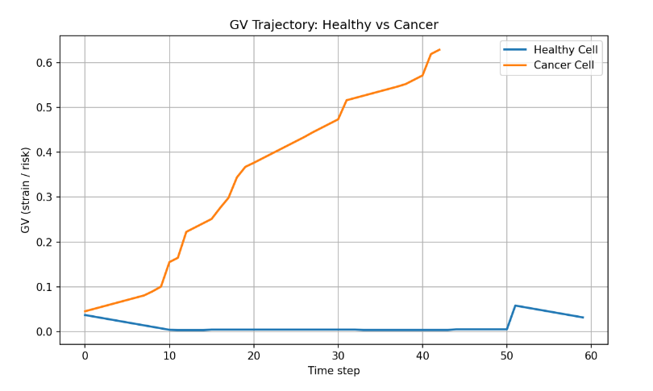
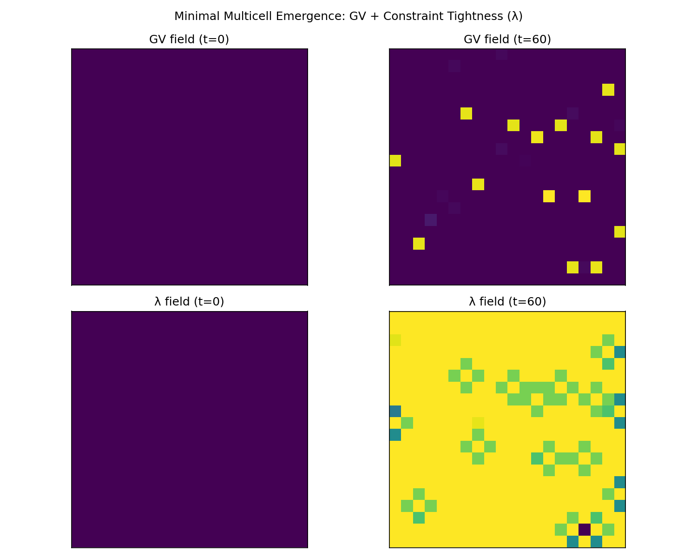

> **Start here (Hub):** https://github.com/willshacklett/god-variable-theory  
> One-click ecosystem map • demos • CI enforcement • runtime monitoring

# Cancer Project

A toy cancer dynamics simulator built on **GV (scalar strain / risk)** and **CFT-inspired constraint coupling**.

This project is intentionally simple: it demonstrates how **constraint failure** drives divergence between healthy and cancerous systems over time.

This model demonstrates that:
- Order and cooperation can emerge from constraint coupling alone
- Characteristic failure modes (invasion, divergence, instability) arise when constraints weaken
- No explicit biological rules are required for cancer-like dynamics to appear

This supports a systems-level view where pathology is a failure of constraint integrity,
not merely a collection of local mutations.

---

## GV Trajectory: Healthy vs Cancer



---

## Multicell Emergence via Constraint Coupling

Below is a spatial GV heatmap from the minimal multicell grid model.

No biological rules are encoded — only local constraint reinforcement
(healthy cells) and erosion (cancer cells). Despite this, invasion-like
patterns and divergence emerge naturally.



---

## What this is

- A **baseline HealthyCell model**
- A **CancerCell model** that exploits weakened constraints
- A **GV (God Variable) score** that rises as strain accumulates  
  (energy loss, damage, arrest failures, uncontrolled division)
- A reproducible simulation that **executes, plots, and saves artifacts**

This is not a medical claim.  
It is a **systems-level demonstration**.

---

### GV update intuition (informal)

GV (God Variable) represents accumulated system strain.

At each timestep:

GVₜ₊₁ = GVₜ + Σ(strain sources) − λ × constraint_strength × GVₜ

Where:
- strain sources include energy loss, damage, checkpoint failure, and division stress
- constraint_strength reflects how well corrective mechanisms function
- λ controls feedback tightness (high in healthy systems, reduced in cancer)

Healthy cells maintain tight feedback, keeping GV bounded.
Cancer cells exploit weakened constraints, allowing GV to grow unchecked.

This is a systems-level demonstration, not a biological or medical claim.

---

## Why this exists

This repo tests a simple question:

> If you relax constraint integrity locally, does emergence appear even without domain-specific rules?

So far, the answer appears to be yes.

---

## Project structure

```text
cft-cancer-sim/
├── README.md
├── pyproject.toml
├── poetry.lock
├── assets/
│   └── gv_healthy_vs_cancer.png
├── src/
│   └── cancer_project/
│       ├── __init__.py
│       ├── env.py
│       ├── gv.py
│       ├── cell_base.py
│       ├── healthy_cell.py
│       ├── cancer_cell.py
│       ├── sim.py
│       └── scripts/
│           ├── __init__.py
│           └── plot_gv.py
└── tests/
